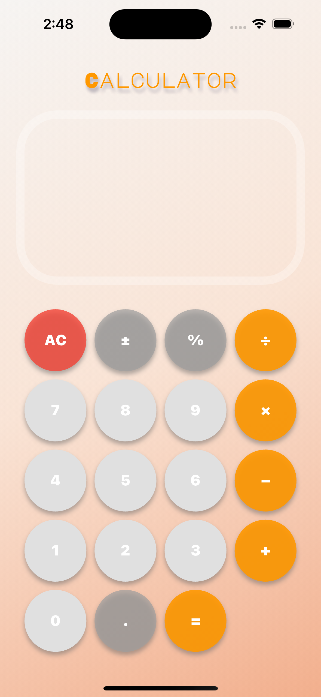

# Flutter Calculator App Using GetX

A simple calculator app built with Flutter, utilizing the GetX state management package for efficient state handling. It supports basic mathematical operations such as addition, subtraction, multiplication, division, and more. The app uses the `math_expressions` package to evaluate mathematical expressions entered by the user.
<div style="display: flex; align-items: center;">
  
</div>


## Features

- Basic calculator functionality: `+`, `-`, `×`, `÷`, `%`, and more.
- State management using `GetX`.
- Supports complex expressions evaluation using `math_expressions`.
- Beautiful UI with a gradient background and customized button styles.
- Responsive layout with support for different screen sizes.

## Packages Used

- `get`: For state management using GetX.
- `google_fonts`: To use Google Fonts for the UI text.
- `math_expressions`: To evaluate mathematical expressions entered by the user.

## Installation

To get started, clone this repository and install the necessary dependencies.

```bash
git clone https://github.com/Vedant0Nisar/calculator.git
cd calculator
flutter pub get
flutter run
